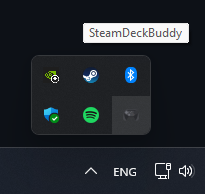
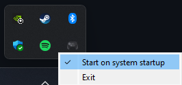
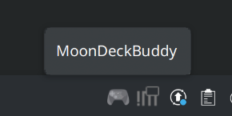
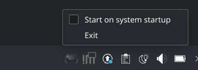

# Windows

### Step 1

Install the latest [redistributables](https://learn.microsoft.com/en-us/cpp/windows/latest-supported-vc-redist) for Windows.

### Step 2

Go to the [Releases](https://github.com/FrogTheFrog/moondeck-buddy/releases) page and grab the latest 7z or exe (installer) release.

### Step 3

Verify that the app is running:



### Step 4

Add MoonDeckStream to the Sunshine Apps List (or GFE while it's still kicking).
See [Sunshine setup](./Sunshine-setup) page for more info.

### Step 5 (optional)

If MoonDeckBuddy is unreachable from outside the PC, whitelist it in Windows' firewall.

### Step 6 (optional)

*Version 1.6.2 and later will have the Windows installer enable autostart by default.*

Enable autostart by clicking on the icon (right-click) and selecting the following option:



## Arch Linux

### Step 1

Install the [moondeckbuddy-appimage](https://aur.archlinux.org/packages/moondeckbuddy-appimage) through the Arch User Repository (AUR).

### Step 2

Start MoonDeckBuddy or MoonDeckStream from the CLI with:

```
$ MoonDeckBuddy
$ MoonDeckStream
```

Continue [Step 3](#step-3-1) in Linux install below.

## Linux Other (AppImage)

### Step 1

Go to the [Releases](https://github.com/FrogTheFrog/moondeck-buddy/releases) page and grab the latest AppImage release.

### Step 2

Setup the AppImage however you want or just apply `chmod +x` to the file.

#### Note about binaries

The AppImage contains 2 binaries `MoonDeckBuddy` and `MoonDeckStream`. By default, when executing `MoonDeckBuddy.AppImage` the `MoonDeckBuddy` binary is executed.

A specific binary can be executed like this:
```
$ MoonDeckBuddy.AppImage --exec MoonDeckBuddy  # This will invoke MoonDeckBuddy binary
$ MoonDeckBuddy.AppImage --exec MoonDeckStream # This will invoke MoonDeckStream binary
```

Another option is to create a symlink that contains the correct binary name. For example:
```
$ ln -s <some_path>/MoonDeckBuddy.AppImage ./MoonDeckStream
$ ./MoonDeckStream # This will invoke MoonDeckStream binary
```

### Step 3

Verify that the app is running:



### Step 4

Add MoonDeckStream to the Sunshine Apps List.
See [Sunshine setup](./Sunshine-setup) page for more info.

### Step 5 (optional)

Enable autostart by clicking on the icon (right-click) and selecting the following option:



## Note about autostart

It creates the shortcut in the user's startup directory pointing to the executable. If you move the executable around it will point to the invalid location and you will need to recreate the shortcut by turning the autostart off and on again.

Also if you remove the app without turning it off, you will need to remove it.

*Version 1.6.2 and later will have the Windows uninstaller automatically remove it.*
