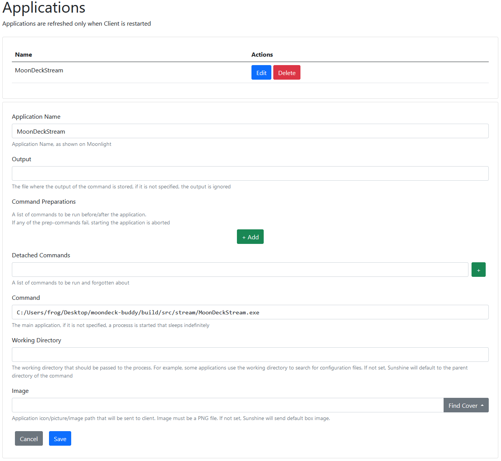
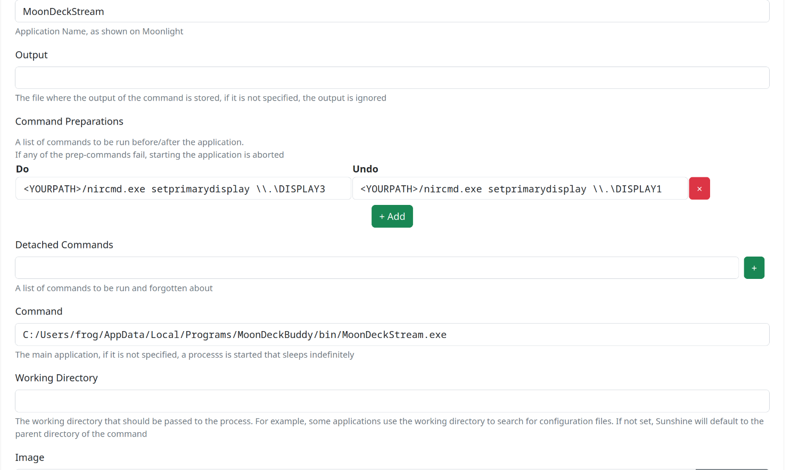
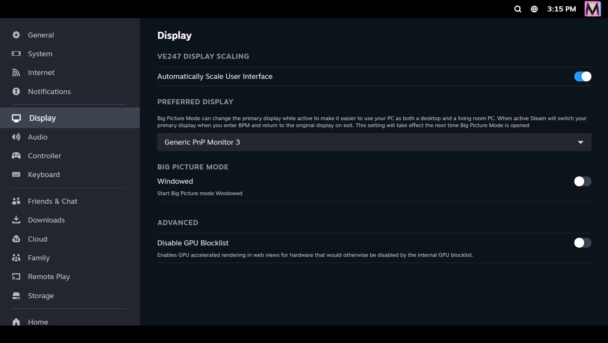

## General

All you have to do is to add a new app with the following:

* "**Application Name**" field set as **MoonDeckStream** (default). You can also customize which application name to use in MoonDeck settings in case you would like to have specialized "do/undo" logic.
* "**Command**" field set to the `MoonDeckStream` executable, using the installation folder created during Moondeck Buddy's setup.
  * On Windows, the default should be `C:\Users\username\AppData\Local\Programs\MoonDeckBuddy\bin\MoonDeckStream.exe`.
  * On Linux, it depends on the earlier setup, but it can be as simple as `/home/frog/Downloads/MoonDeckBuddy.AppImage --exec MoonDeckStream`.

Bellow an example of the required settings using a non-standard installation path:

## Streaming other displays

By default, almost every application uses the default display when starting up. In case you want to use other display for streams, here's what you need to do (Windows shall be used as an example with a `\\.\DISPLAY3` as the end goal):

1. Configure Sunshine to use the desired display for stream capture:

2. Configure Buddy, to use correct display for changing resolution by setting the `handled_displays` (see [Buddy configuration](Buddy-configuration) page) option to `["\\\\.\\DISPLAY3"]` (note the additional slashes).
3. Configure **MoonDeckStream** app entry in Sunshine to change primary display before and after stream. On Windows you can use [NirCmd](https://www.nirsoft.net/utils/nircmd.html) to achieve this. This step is necessary as most of the games use the default display when starting up.

4. You **might** also want to change Steam's Big Picture preferred display if it starts elsewhere ignoring the step 3.

