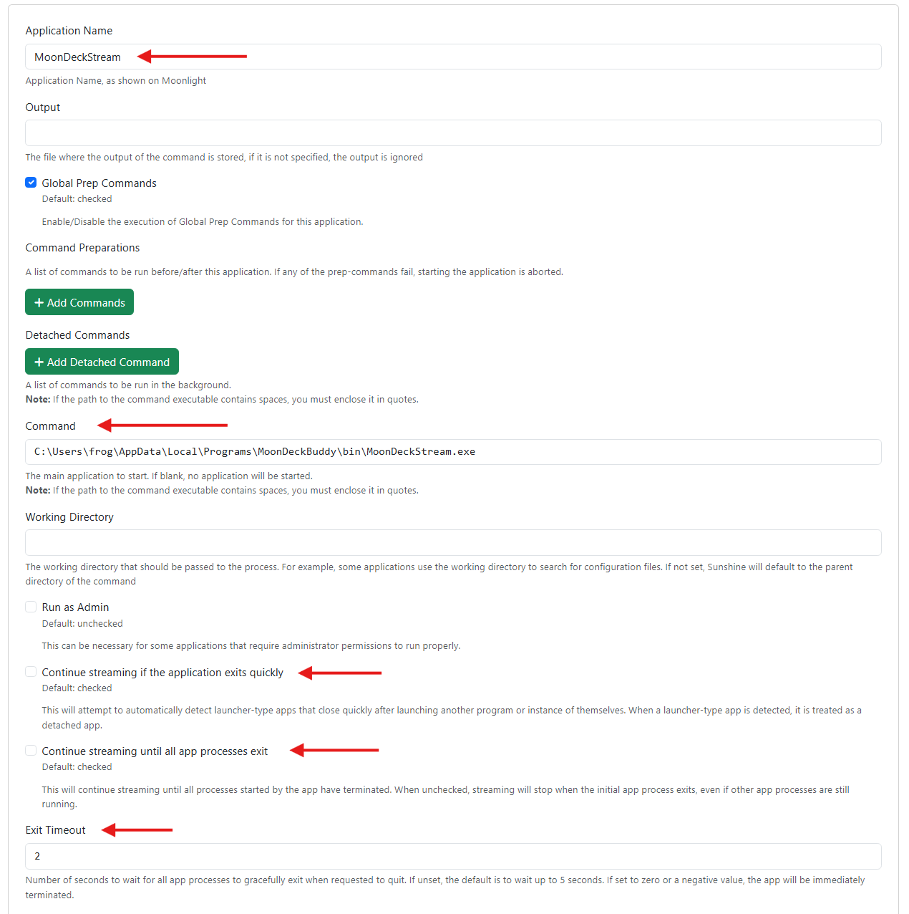
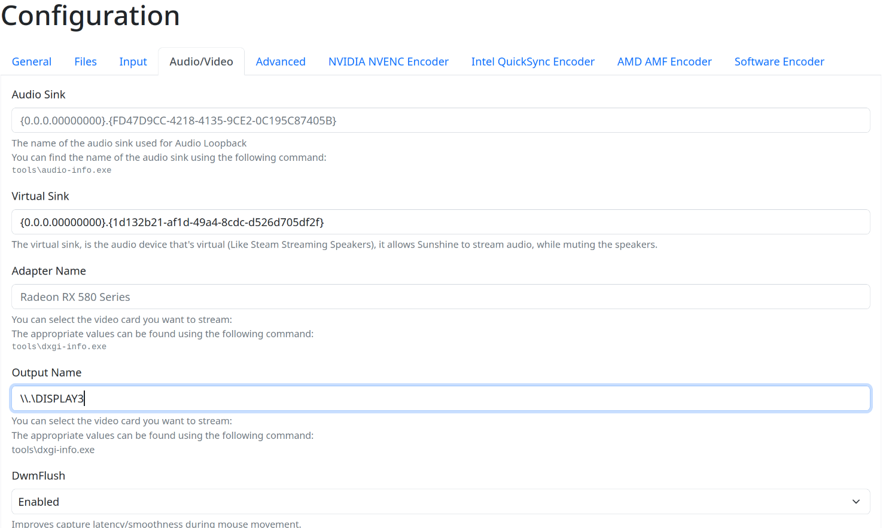
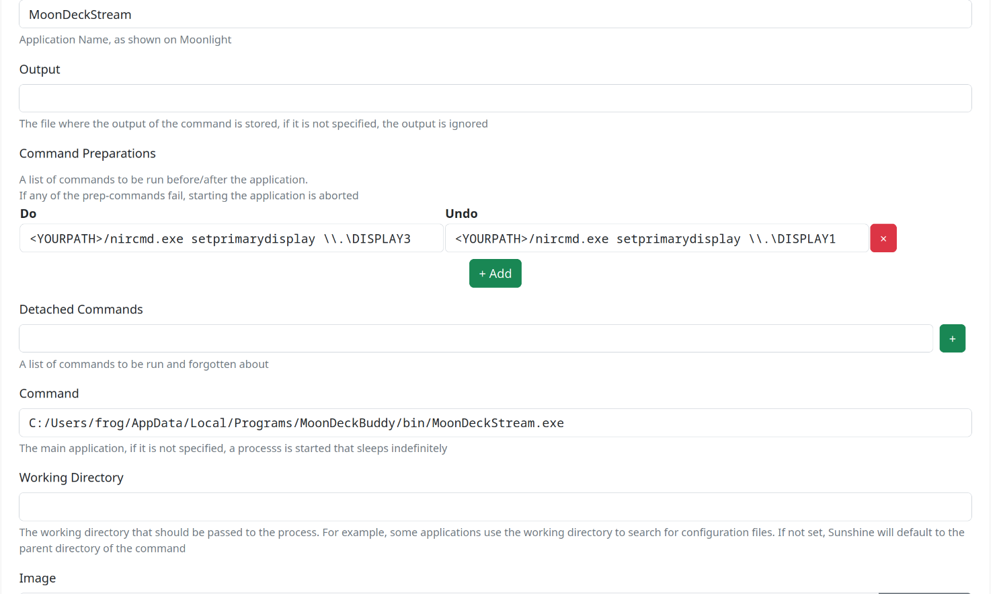

## General

All you have to do is to add a new app with the following:

* "**Application Name**" field set as **MoonDeckStream** (default). You can also customize which application name to use in MoonDeck settings in case you would like to have specialized "do/undo" logic.
* "**Command**" field set to the `MoonDeckStream` executable, using the installation folder created during Moondeck Buddy's setup.
  * On Windows, the default should be `<BuddyInstallDirectory>\bin\MoonDeckStream.exe` (replace `<BuddyInstallDirectory>` with the file path of where it is installed).
  * On Linux, it depends on the earlier setup, but it can be as simple as `/home/frog/Downloads/MoonDeckBuddy.AppImage --exec MoonDeckStream`.
* "**Continue streaming...**" - just disable the checkbox.

Bellow an example of the required settings using a non-standard installation path:



## [Windows] Disable HDR while streaming

If you have HDR enabled, you can use the Windows' keyboard shortcut to toggle HDR.

This can be automated with this [tool](https://github.com/ejams1/HDRToggle) or this script which will emulate the shortcut input for you:
```
$source = @"
using System;
using System.Threading.Tasks;
using System.Runtime.InteropServices;
using System.Windows.Forms;
namespace Sunshine
{
    public class Utils
    {
        [DllImport("user32.dll")]
        public static extern void keybd_event(byte bVk, byte bScan, int dwFlags, int dwExtraInfo);

        private const int KEYEVENTF_EXTENDEDKEY = 0x0001;
        private const int KEYEVENTF_KEYUP = 0x0002;

        // From https://learn.microsoft.com/en-us/windows/win32/inputdev/virtual-key-codes
        private const byte VK_LWIN = 0x5B;
        private const byte VK_ALT = 0x12;
        private const byte VK_B = 0x42;

        public static void ToggleHdr()
        {
            // Press down the keyboard shortcut
            keybd_event(VK_ALT, 0, KEYEVENTF_EXTENDEDKEY, 0);
            keybd_event(VK_LWIN, 0, KEYEVENTF_EXTENDEDKEY, 0);
            keybd_event(VK_B, 0, KEYEVENTF_EXTENDEDKEY, 0);

            // Release the keyboard shortcut
            keybd_event(VK_B, 0, KEYEVENTF_EXTENDEDKEY | KEYEVENTF_KEYUP, 0);
            keybd_event(VK_LWIN, 0, KEYEVENTF_EXTENDEDKEY | KEYEVENTF_KEYUP, 0);
            keybd_event(VK_ALT, 0, KEYEVENTF_EXTENDEDKEY | KEYEVENTF_KEYUP, 0);
        }
    }
}
"@
Add-Type -TypeDefinition $source -ReferencedAssemblies "System.Windows.Forms"

Write-Output "Toggle HDR"
[Sunshine.Utils]::ToggleHdr()
Write-Output "HDR toggled"
```

Save it to `togglehdr.ps1` somewhere and insert the following command into the "do/undo" fields:

`C:\Windows\System32\WindowsPowerShell\v1.0\powershell.exe -ExecutionPolicy Bypass -File "<ScriptLocationDirectory>\togglehdr.ps1"` (replace `<ScriptLocationDirectory>` with an actual directory)

## [Windows + Nvidia GPU] Toggle G-Sync

Sometimes there might be some strange behaviour caused by G-Sync:
- FPS locked to 58 FPS instead of 60;
- frame instability (not stuttering, but just does not feel "right").

If you notice such issues, you can toggle the G-Sync using this command line [tool](https://github.com/FrogTheFrog/gsync-toggle).

## [Windows + Nvidia GPU] Toggle Frame Rate Limiter

If you're using the Nvidia's built-in frame limiter, you can use this command line [tool](https://github.com/FrogTheFrog/frl-toggle) change it while streaming.

## Streaming other displays

By default, almost every application uses the default display when starting up. In case you want to use other display for streams, here's what you need to do (Windows shall be used as an example with a `\\.\DISPLAY3` as the end goal):

1. Configure Sunshine to use the desired display for stream capture:

2. Configure Buddy, to use correct display for changing resolution by setting the `handled_displays` (see [Buddy configuration](Buddy-configuration) page) option to `["\\\\.\\DISPLAY3"]` (note the additional slashes).
3. Configure **MoonDeckStream** app entry in Sunshine to change primary display before and after stream. On Windows you can use [NirCmd](https://www.nirsoft.net/utils/nircmd.html) to achieve this. This step is necessary as most of the games use the default display when starting up.

4. You **might** also want to change Steam's Big Picture preferred display if it starts elsewhere ignoring the step 3.


