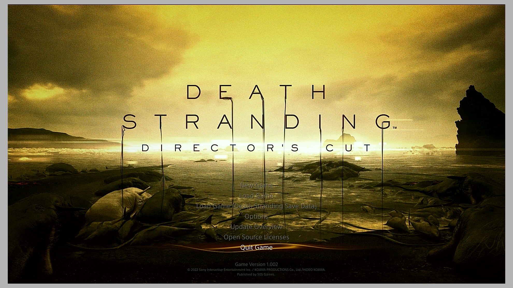
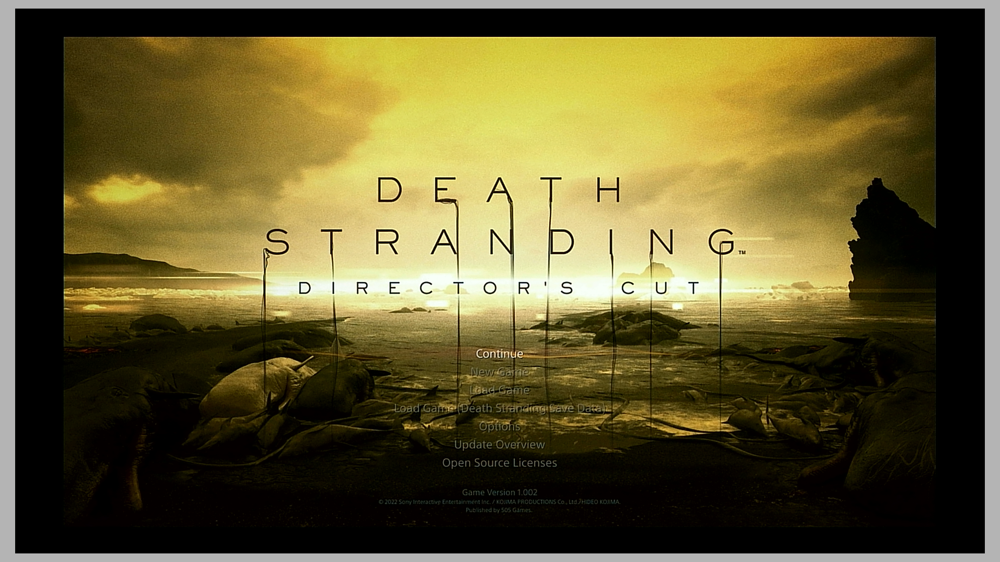
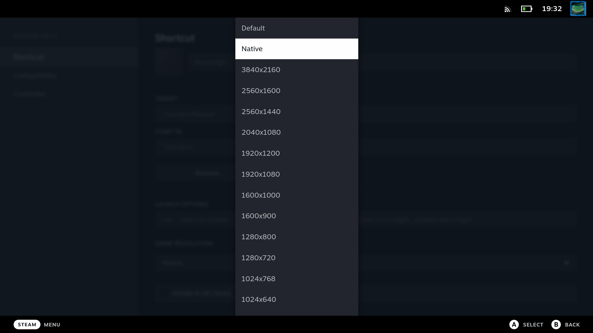
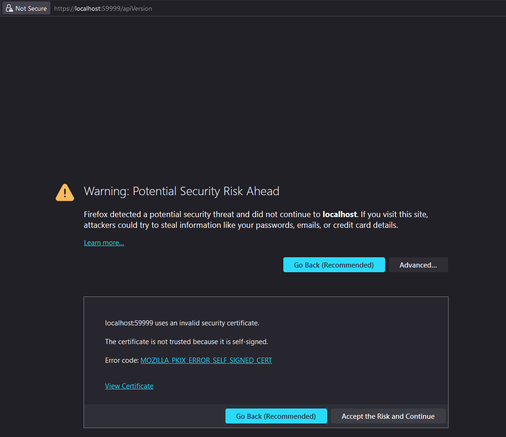

## [SteamDeck] Black borders/Strange resolution/Strange scaling

This issue mostly haunts people using external displays.

Instead of a correctly scaled image like this:

You might end up with some black borders or otherwise cropped image:

### So far, there are 2 known sources of this issue:

#### Issue 1

The external display is selected as a primary one. For some reason this can really mess with Gamescope if MoonDeck tries to pass custom resolution to Moonlight. Disabling the "pass to Moonlight" option in MoonDeck resolves this, but the other benefits are also gone. Unless Valve fixes this, the real solution is to have SteamDeck screen as primary display.

#### Issue 2

The Moonlight's display resolution used by Gamescope is set to anything other than the actual display size. It should at **least** be set to native: 

##### MoonDeck already helps you with this!

MoonDeck already tries to select the best resolution for Steam games (check the `Host Settings` tab in the plugin).

For Sunshine apps, MoonDeck allows to set the display resolution for all imported apps at once with a click of a button!

## [SteamDeck] Failed to find application MoonDeckStream

Make sure the [Sunshine setup](./Sunshine-setup) step has been completed.

If it still does not work, it could be one of the following:
* Restart Sunshine (yes, it really helps sometimes).
* In some rare cases the app list is not synced between Sunshine and Moonlight. Manually verify that MoonDeckStream is in the app list, otherwise forget the host and add it again.
* If you have multiple host sharing very similar name where only difference is lower-case and upper-case letters, Moonlight might also select an incorrect one to start the stream with.
* You still have Nvidia Gamestream enabled and the Moonlight tries to connect it instead of Sunshine.

## [Windows] Controller input is not working

This is a Sunshine or Moonlight issue. If migrating from Sunshine version <0.17, they recommend to do a complete reinstall. Otherwise try reinstalling `ViGEmBus` (on Windows) or asking on their Discord for support.

## [Windows|Linux] Buddy appears offline/cannot be paired

### Make sure that Buddy server is up and running.

Enter the following on the host PC in a web browser (assuming that you did not change the port):
`https://localhost:59999/apiVersion`

You should see something along the lines of:

This means that everything is OK **if** it is complaining about self signed certificate.

#### ERR_SSL_VERSION_OR_CIPHER_MISMATCH

If you're getting this error code instead, you need to downgrade the SSL protocol version to TLS 1.2 (see [Buddy configuration](./Buddy-configuration) page). Don't forget to restart Buddy afterwards!

### Make sure that Buddy is not blocked by the firewall

Either add a firewall rule or make sure you have clicked "allow" when the Buddy was first launched.
Buddy should reachable on SteamDeck's web browser by entering `https://<host_ip>:<buddy_port>/apiVersion` (see section above on how the page should look like).

## [Windows] Steam's Big Picture mode is launched, but not the game

The new Big Picture mode has this "Input Tutorial" popup that is shown once when you have a controller plugged in. For this tutorial to be considered done, you needed to just go through it.

In some cases this will prevent Buddy from launching the game, because the tutorial was not done for the `ViGEmBus` controller. If this happens, just guide MoonDeck for the first time be launching the game if it's stuck in the **Home** page.

In some rare cases this tutorial will never show up and will always be considered as incomplete - you won't be able to launch games directly. What causes this is unknown, but clearing the Steam's user data or reinstalling the Steam seems to help - tutorial will be shown next time.

To check if this case applies to you, close Steam and run the following in a terminal or Windows' Run window (Win+R):

`"<path_to_steam_exe>" -bigpicture -applaunch <some_app_id>`

If this works, then you have a working command line. Now close Steam and run the same command while you are streaming **Desktop** directly via Moonlight. If the game does not launch (only **Home** page is shown), you are affected by this issue.